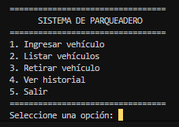
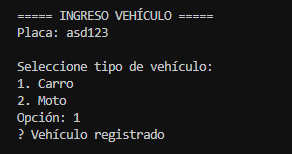
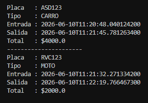

# 🚗 Sistema de Parqueadero en Java


## 📌 Descripción del Sistema

Este es un sistema de gestión de parqueadero profesional desarrollado en Java. A diferencia de las versiones iniciales que utilizaban archivos de texto, esta versión implementa persistencia de datos real mediante MySQL, garantizando integridad, escalabilidad y consultas eficientes. El sistema gestiona ingresos, salidas, cálculos de tarifas dinámicas, historial detallado y métricas financieras en tiempo real.

## 🏗️ Arquitectura del Sistema

El sistema utiliza una arquitectura modular basada en capas para separar las responsabilidades:

* **Capa de Modelo (model):** Define las entidades del negocio (Vehículo, Movimiento, TipoVehículo).
* **Capa de Servicio (service):** Contiene la lógica de negocio, cálculos de tarifas y orquestación de procesos.
* **Capa de Utilidades/Infraestructura (util):** Gestiona la conexión a la base de datos (JDBC) y configuraciones del sistema.
* **Capa de Interfaz** (Main): Punto de entrada del usuario a través de un menú interactivo en consola

---

## 💾 Estructura de la Base de Datos

El sistema opera con tres tablas relacionales optimizadas dentro de sistema_parqueadero:

* **vehiculos_activos:** Mantiene en tiempo real solo los vehículos que están dentro del parqueadero.
* **historial_movimientos:** Registro de auditoría permanente de todas las entradas y salidas con sus respectivos costos.
* **tarifas:** Configuración centralizada de precios, permitiendo cambios sin necesidad de recompilar el código.

---

## ▶️ Script SQL

```text
-- 1. Crear la base de datos
CREATE DATABASE IF NOT EXISTS sistema_parqueadero;
USE sistema_parqueadero;

-- 2. Crear tabla de tarifas (Configuración centralizada)
CREATE TABLE IF NOT EXISTS tarifas (
    tipo_vehiculo VARCHAR(20) PRIMARY KEY,
    valor_hora INT NOT NULL
);

INSERT IGNORE INTO tarifas (tipo_vehiculo, valor_hora) VALUES ('CARRO', 4000);
INSERT IGNORE INTO tarifas (tipo_vehiculo, valor_hora) VALUES ('MOTO', 2000);

-- 3. Crear tabla de vehículos activos
CREATE TABLE IF NOT EXISTS vehiculos_activos (
    placa VARCHAR(10) PRIMARY KEY,
    tipo_vehiculo VARCHAR(20),
    fecha_ingreso DATETIME DEFAULT CURRENT_TIMESTAMP
);

-- 4. Crear tabla de historial
CREATE TABLE IF NOT EXISTS historial_movimientos (
    id INT AUTO_INCREMENT PRIMARY KEY,
    placa VARCHAR(10),
    tipo_vehiculo VARCHAR(20),
    fecha_ingreso DATETIME,
    fecha_salida DATETIME DEFAULT CURRENT_TIMESTAMP,
    total_pagado INT
);

```

---

## 📸 Capturas del Sistema

### Menú Principal



### Registro de Vehículo



### Historial de Movimientos



---

## ⚙️ Funcionalidades

* **Gestión dinámica:** Ingreso y retiro de vehículos con validación de placa.
* **Cálculo inteligente:** Tarifas diferenciadas para carros y motos con cobro mínimo de 1 hora.
* **Reportes Financieros:** Cálculo de ingresos totales, mensuales y promedio por ticket.
* **Configuración en caliente:** Actualización de tarifas directamente desde la base de datos mediante el menú de configuración.
* **Estadísticas:** Visión clara de ocupación, disponibilidad y flujo histórico.

---

## 🏗️ Estructura del Proyecto

```text
SistemaParqueadero/
│
├── bin/                              # Bytecodes compilados (.class)
│
├── lib/                              # Librerías externas (Dependencias)
│   └── mysql-connector-j-9.7.0.jar
│
├── src/                              # Código fuente organizado por responsabilidades
│   ├── model/                        # Capa de Entidades (Clases de datos y Enums)
│   │   ├── Vehiculo.java
│   │   ├── Movimiento.java
│   │   └── TipoVehiculo.java
│   │
│   ├── service/                      # Capa de Servicio (Lógica central del negocio)
│   │   └── Parqueadero.java
│   │
│   ├── util/                         # Capa de Infraestructura y Conexión
│   │   ├── AppConfig.java            # Configuración de conexión (DB URL, User, Pass)
│   │   └── ConexionDB.java           # Gestión de la conexión JDBC a MySQL
│   │
│   └── Main.java                     # Controlador de la interfaz de usuario en consola
│
├── .gitignore                        # Archivos excluidos del control de versiones
└── README.md                         # Documentación del proyecto
```

---

## 📊 Arquitectura y Flujo del Sistema

### Diagrama de Dependencias (UML de Flujo)

```text
Main (Vista)
      │
      ▼
Parqueadero (Service - Orquestador Funcional)
      │
      ├──► Vehiculo / Movimiento (Model)
      └──► ConexionDB (Util - Persistencia en MySQL)
```

### ➤ Flujo de Trabajo

1. **Ingreso de Vehículo**

* Validación: El sistema verifica que la placa no esté registrada en el área activa.
* Acción: Se realiza un INSERT en la tabla vehiculos_activos.
* Resultado: El vehículo queda oficialmente registrado dentro del parqueadero.

2. **Permanencia y Consulta**

* Acción: El usuario consulta el estado actual del sistema mediante un SELECT a la tabla vehiculos_activos.
* Utilidad: Permite visualizar la ocupación en tiempo real y buscar vehículos específicos dentro del parqueadero.

3. **Salida y Facturación (Transacción Crítica)**

* Cálculo: Se procesa el tiempo transcurrido desde el ingreso.
* Tarificación: Se consulta la tarifa vigente en la tabla tarifas.
* Registro Histórico: Se realiza un INSERT en la tabla historial_movimientos con todos los detalles (entrada, salida, placa, tipo y valor pagado).
* Liberación: Se ejecuta un DELETE en vehiculos_activos para liberar el espacio.
* Resultado: El registro se vuelve permanente y auditable para siempre en el historial.

4. **Gestión de Historial**

* Acción: El usuario consulta el flujo completo mediante un SELECT a historial_movimientos.
* Utilidad: Permite generar reportes financieros, métricas de rendimiento y búsquedas detalladas de vehículos que ya no se encuentran en las instalaciones.

---

## ▶️ Cómo Ejecutar el Proyecto

1. **Compilar los archivos fuente:**
   javac -d bin -cp "lib/*" src/model/*.java src/service/*.java src/util/*.java src/Main.java

2. **Ejecutar la aplicación:**
   java -cp "bin;lib/*" Main

---

## 🛠️ Tecnologías Utilizadas

* **Lenguaje:** ☕ Java (JDK 8 o superior).
* **Persistencia:** MySQL (JDBC).
* **Patrón:** Arquitectura en capas (Layered Architecture).
* **Paradigma:** Programación Orientada a Objetos (POO).
* **Arquitectura:** Estructura limpia organizada por capas (`model` / `service` / `util`).

---

## 🚀 Roadmap (Mejoras Futuras)

* [ ] Desarrollo de API REST con Spring Boot.
* [ ] Implementación de Frontend web con React.
* [ ] Interfaz gráfica de escritorio con JavaFX
* [ ] Autenticación de usuarios con roles y permisos.
* [ ] Exportación masiva de reportes a PDF y Excel.

---

## 😎 Autor

Proyecto desarrollado por Jonathan Aristizabal como práctica de arquitectura de software en Java, aplicando conceptos de POO, separación por capas y persistencia estructurada en archivos.
